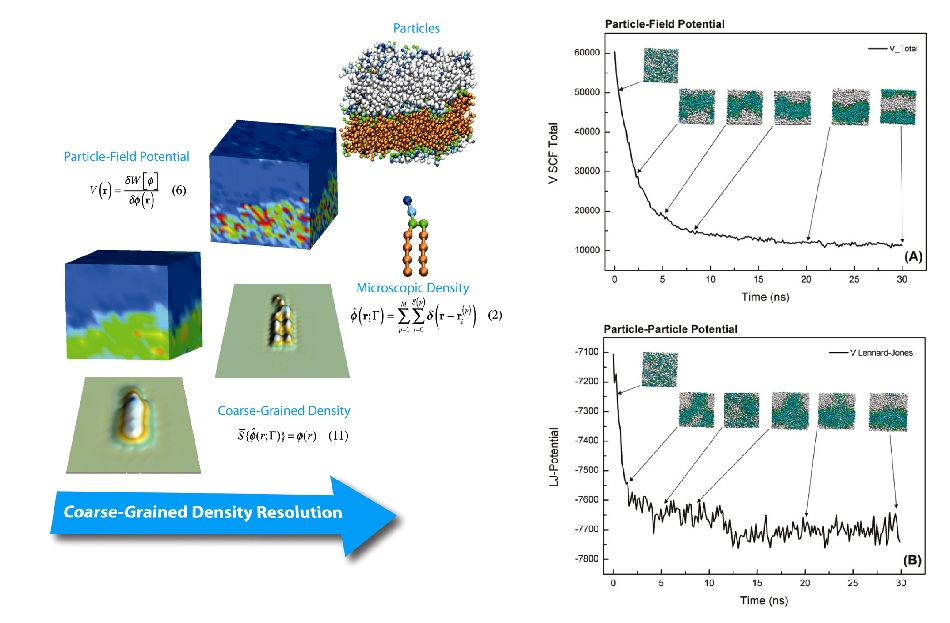
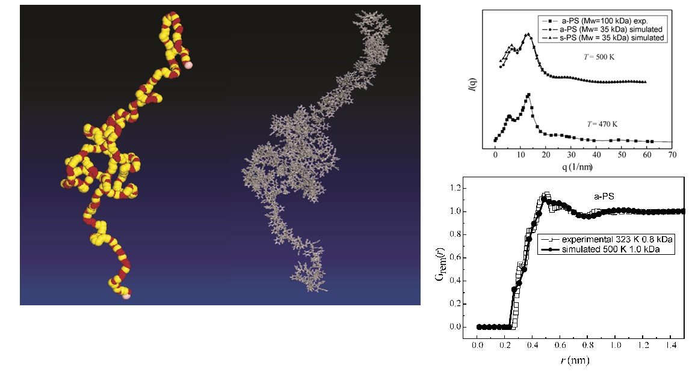
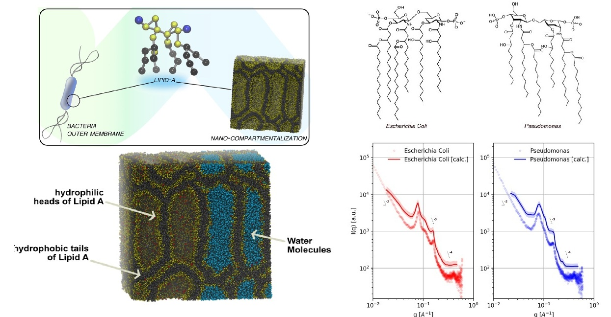

{.profile-photo fig-alt="Giuseppe Milano"}

I work at the border between two ways of understanding matter: the chemist’s attention to molecular identity and the physicist’s search for mathematical and computational descriptions.

I want to understand how molecular interactions give rise to collective behaviour, and how this connection can be represented across different levels of resolution. Multiscale molecular simulation provides a way to connect different scales, following the emergence of collective behaviour without losing chemical specificity.

Across polymers, biomembranes, surfactants, nanocomposites, and nanoplastics, the underlying goal remains the same: connecting molecular detail with collective organization without sacrificing either.
A central and continuing focus of my work is hybrid particle–field molecular dynamics (hPF‑MD). For more than fifteen years, I have continued to advance this approach and its implementation in OCCAM, a massively parallel molecular simulation code that combines chemically specific molecular models with field-based descriptions of non-bonded interactions, enabling simulations of large and complex systems without losing molecular architecture and identity.

## Themes in my work

:::: {.grid}

::: {.g-col-12 .g-col-md-6}
[{fig-alt="Multiscale molecular simulation of a lipid membrane"}](multiscale-methods.qmd)

### [Molecular Simulation and Statistical Mechanics](multiscale-methods.qmd)

Coarse-graining, particle–field models, and high-performance molecular simulation.
:::

::: {.g-col-12 .g-col-md-6}
[{fig-alt="Coarse-grained and atomistic representations of polymer chains"}](polymers-soft-matter.qmd)

### [Polymers and Soft Matter](polymers-soft-matter.qmd)

Polymer dynamics, complex molecular architectures, and collective organization.
:::

::: {.g-col-12 .g-col-md-6}
[{fig-alt="Molecular organization at a carbon black polymer interface"}](interfaces-nanomaterials.qmd)

### [Interfaces and Nanomaterials](interfaces-nanomaterials.qmd)

Molecular organization at polymer, nanoparticle, and material interfaces.
:::

::: {.g-col-12 .g-col-md-6}
[{fig-alt="Molecular model of a complex biological membrane"}](biological-environmental-systems.qmd)

### [Biological and Environmental Systems](biological-environmental-systems.qmd)

Biomembranes, complex biointerfaces, and the molecular behaviour of nanoplastics.
:::

::::
