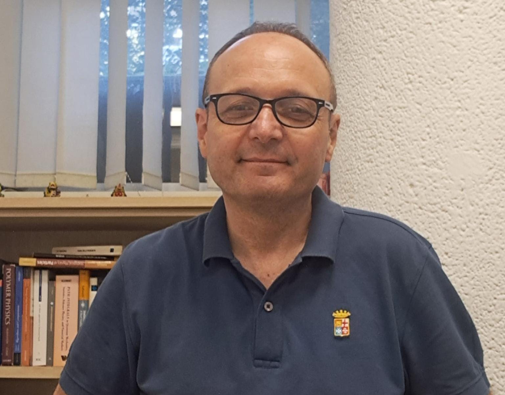

{.profile-photo fig-alt="Giuseppe Milano"}

I have always worked at the border between two ways of thinking about matter: the chemist's attention to specific molecular structure, and a physicist's instinct for describing that matter mathematically and numerically. Trained as a chemist, I have spent much of my scientific path trying to hold these two perspectives together rather than choose between them.

Working at this border, I keep returning to one question: how can we model molecular systems that are large, heterogeneous, and evolve on timescales far beyond what atomistic detail alone can reach — without losing the chemical identity, architecture, and specificity that make them what they are?

Following this question has taken me from atomistic and coarse-grained polymer simulations, through reverse mapping, to hybrid particle-field molecular dynamics. To turn these ideas into something usable, I have led the development of the software myself — most notably OCCAM, a massively parallel code, capable of running on multi-GPU architectures, that performs hybrid particle-field molecular dynamics (hPF-MD), pushing simulations into the multi-billion-particle regime. OCCAM was the first code of its kind, and its development now spans about fifteen years, coupling molecular-level chemical specificity with the slow, collective dynamics of mesoscale systems, and making it possible to follow the evolution of large, heterogeneous molecular systems without averaging away what makes them chemically distinct.

Along the way, the range of systems I work on has grown: polymer melts, biomembranes, surfactants, nanocomposites, polymer brushes, carbon black interfaces, nanoplastics. What has stayed the same is the underlying problem — connecting molecular detail to collective organization, without sacrificing one for the other.

This website tells that path: the questions that have shaped my work as a chemist drawn to physics, the methods I have developed to hold the two together, the systems that have tested them, and the directions I am exploring now.

## Themes in my work

- Molecular simulation of chemically complex soft matter
- Coarse-grained models and reverse mapping
- Hybrid particle--field molecular dynamics
- OCCAM and scalable simulation platforms
- Polymers, membranes, nanocomposites and nanoplastics
- Density-based descriptions of collective organization