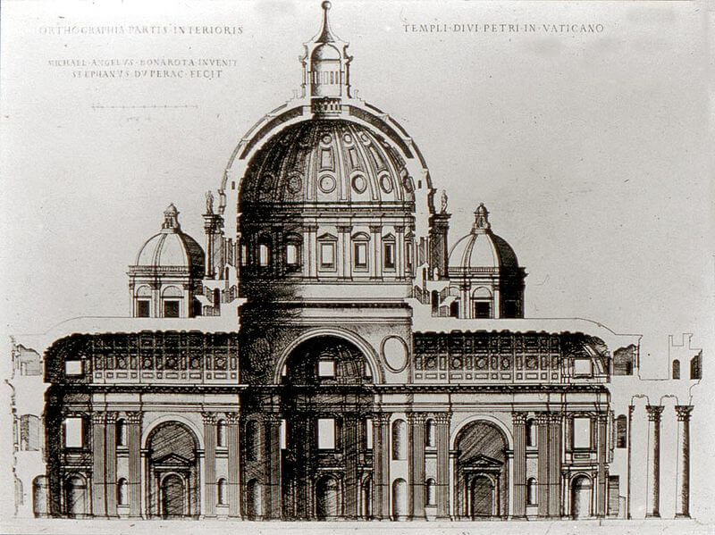

OCCAM is a molecular simulation platform developed for hybrid particle-field molecular dynamics of chemically complex soft-matter systems.

[{width="85%" fig-alt="OCCAM"}](https://sites.google.com/view/occammd/home){target="_blank"}

Methodological developments of my research group are implemented and tested in OCCAM, which provides the computational framework for exploring how different levels of molecular and field-based description can be combined in large-scale simulations.It is part of a broader effort to make density-field molecular simulations scalable, reproducible and useful for systems where molecular identity and mesoscale organization are both important.

## Why OCCAM

Many soft-matter systems are too large, heterogeneous or slowly evolving to be efficiently studied with conventional molecular dynamics alone.

OCCAM was developed to address this class of problems by combining molecular particles with density fields. Molecular particles retain architecture, connectivity and chemical identity, while density fields describe collective interactions and spatial organization.

## Scientific role

For me, OCCAM is not only a computational tool. It is a platform where methodological ideas can be implemented, tested and applied to real chemical systems.

It connects several parts of my work:

- coarse-grained molecular simulation;
- hybrid particle--field molecular dynamics;
- polymers and soft materials;
- biomembranes and interfaces;
- nanocomposites and nanoplastics;
- scalable scientific computing.

## Current use

OCCAM is used to study chemically specific soft-matter systems where collective organization plays a central role.

Examples include polymer melts, surfactant assemblies, biomembranes, grafted polymers, brushes, polymer nanocomposites and micro/nanoplastics.

## Development

Recent development has focused on performance, scalability and the extension of the code toward more complex molecular models and workflows.

In a very Italian sense, I sometimes think of OCCAM as a small “Fabbrica di San Pietro”: a living construction site rather than a finished object. It grows through additions, corrections, repairs and new ambitions, while preserving traces of the scientific questions that originally motivated it.

[{width="85%" fig-alt="Permanent work in progress"}](https://en.wikipedia.org/wiki/Fabric_of_Saint_Peter){target="_blank"}

At the same time, a living construction site cannot remain permanently provisional. Every few years, together with different collaborators and students, we consolidate the code into an official version. These versions collect the implementations that have been tested, validated and used in scientific applications, providing stable reference points for further developments.

For me, software is not separate from scientific vision. It is the place where theoretical ideas become operational, where algorithms reveal their strengths and limitations, and where applications show what a method can and cannot do.

This experience also shapes the way I think about training young researchers.

## The craft of simulation code

However, those who want to develop new simulation methods should, sooner or later, experience the discipline of writing simulation code closer to the hardware and to the numerical structure of the algorithm, in languages such as Fortran, C or C++.

Implementing a method forces one to understand it at a deeper level. It makes approximations explicit, exposes numerical assumptions, and shows where an elegant theoretical idea becomes fragile, robust or useful.

For this reason, I see simulation code as part of scientific formation. It is not only an instrument for producing results, but a place where physical intuition, mathematical formulation, algorithmic thinking and chemical interpretation come together.

OCCAM also reflects a broader view of scientific training.

There is a craft dimension in this process. Perhaps one could say, with a smile, that writing a simulation code is closer to learning the way of the sword than to simply using a more powerful weapon. It is not about nostalgia for older tools, and certainly not about rejecting modern software. It is about discipline, control, attention to detail, and understanding the instrument through practice.

[{width="85%" fig-alt="Early atomistic molecular dynamics works"}](https://en.wikipedia.org/wiki/The_Book_of_Five_Rings){target="_blank"}

Implementing a method forces one to understand it at a deeper level. It makes approximations explicit, exposes numerical assumptions, and shows where an elegant theoretical idea becomes fragile, robust or useful.

For this reason, I see simulation code as part of scientific formation. It is not only an instrument for producing results, but a training ground where physical intuition, mathematical formulation, algorithmic thinking and chemical interpretation come together.

In this sense, OCCAM is also a training environment: a place where young researchers can learn how molecular models, algorithms and scientific questions are connected.

## A continuing direction

Looking back, the systems and methods have changed, but the underlying question has remained remarkably stable.

How can molecular simulation describe complex systems across scales while preserving the chemical identity of matter?

My path toward larger scales and more efficient methods has never been a path of replacement. I have not seen coarse-graining, field-based descriptions or hybrid particle-field molecular dynamics as ways to leave atomistic modelling behind, but as ways to carry forward what atomistic modelling teaches: molecular architecture, chemical specificity, physically grounded interactions and a disciplined connection between models and interpretation.

In this sense, moving across scales does not mean abandoning the previous level of description. It means preserving what is essential from it, translating it when needed, and building methods that remain connected to molecular chemistry even when they operate at larger length and time scales.

This attitude continues to guide my current work on coarse-grained and hybrid particle-field approaches, density-based descriptions, scalable simulation methods and applications to complex soft matter, materials and biological interfaces.

## Publication-based code timeline

2009 - Original hPF-MD implementation: Core hybrid particle-field molecular dynamics implementation and dense-polymer applications establish the methodological basis of the OCCAM code family.
[Journal of Chemical Physics 2009](https://doi.org/10.1063/1.3142103){target="_blank"}

2012 - Multi-node multi-CPU parallelization: MPI molecular decomposition and density-field reductions demonstrate that OCCAM can scale to large hPF-MD systems.
[Journal of Computational Chemistry 2012](https://doi.org/10.1002/jcc.22883){target="_blank"}

2021 - Optimized multi-CPU large-scale: Interface-aware, derivative, interpolation optimizations enable multi-million bead simulations
[Journal of Chemical Theory and Computation 2021](https://doi.org/10.1021/acs.jctc.0c01095){target="_blank"}

2025 - Multi-node multi-GPU OCCAM: GPU-resident implementation suitable for giant simulations up to 10 billion-particle scales.
[Journal of Computational Chemistry 2025](https://doi.org/10.1002/jcc.70126){target="_blank"}
