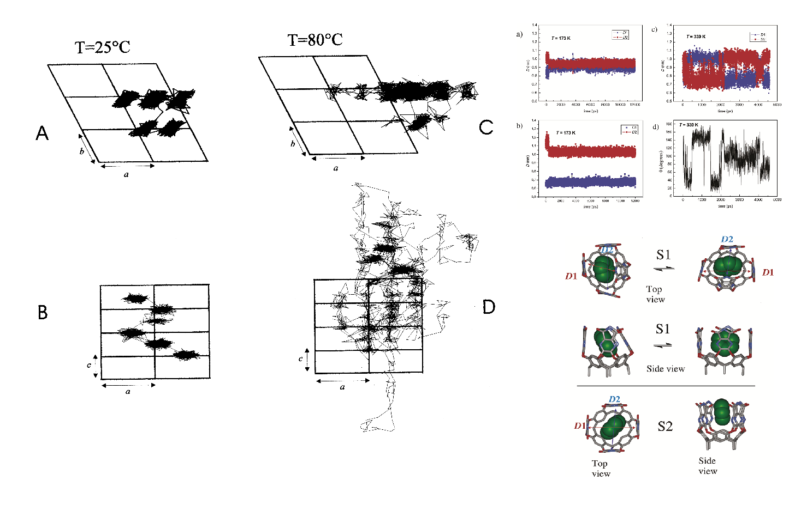
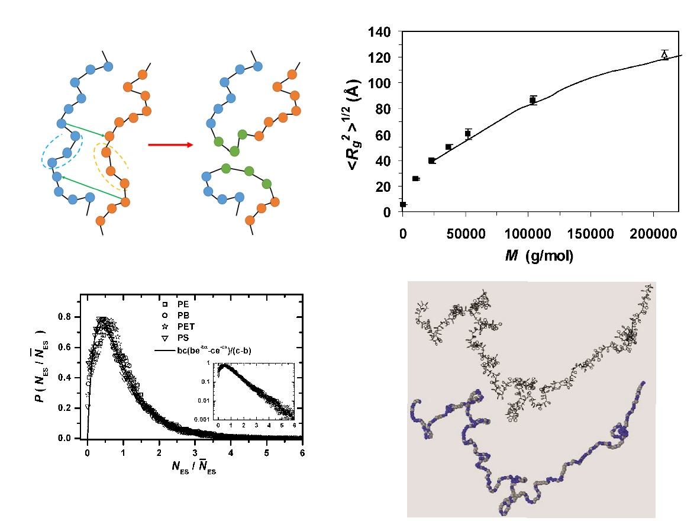

Polymer dynamics, entanglement, complex molecular architectures and collective organization.

Polymers have been the main testing ground for my way of connecting molecular detail to collective behaviour. Their chemistry is encoded locally, but their observable properties emerge from conformations, packing, entanglements, interfaces and relaxation over much larger scales.

## From molecular structure to collective behaviour

My early atomistic simulations examined how molecular architecture and local interactions determine structure, dynamics and transport in polymeric materials. They also made the limitations of full atomistic resolution very clear: long chains and slowly relaxing soft matter rapidly move beyond directly accessible scales.

[{width="85%" fig-alt="Atomistic molecular dynamics study of a polymeric material"}](https://doi.org/10.1021/cm011297i){target="_blank"}

## Long-chain melts and entanglements

Chemically informed coarse-grained models, connectivity-altering Monte Carlo moves and reverse mapping made it possible to equilibrate long-chain atactic polystyrene melts while retaining stereochemical information. The resulting structures connect efficient mesoscale equilibration with detailed united-atom descriptions and experimentally relevant observables, including chain conformation and entanglements.

[{width="85%" fig-alt="Long-chain atactic polystyrene represented across different resolutions"}](https://doi.org/10.1021/ma0700983){target="_blank"}

## Soft-matter organization

The same multiscale perspective extends from polymer melts to surfactant self-assembly, polymer brushes, grafted materials and nanocomposites. Across these systems, I am interested in how molecular architecture and specific interactions produce mesoscale organization, interfacial structure and slow collective dynamics.

[{width="70%" fig-alt="Molecular simulation of polymer brushes"}](publications.qmd)

This is also where methodological questions become physical ones: how much chemical detail is needed, which collective variables govern the behaviour, and how can simulations reach the scales on which those variables evolve?

[Selected publications](publications.qmd)
