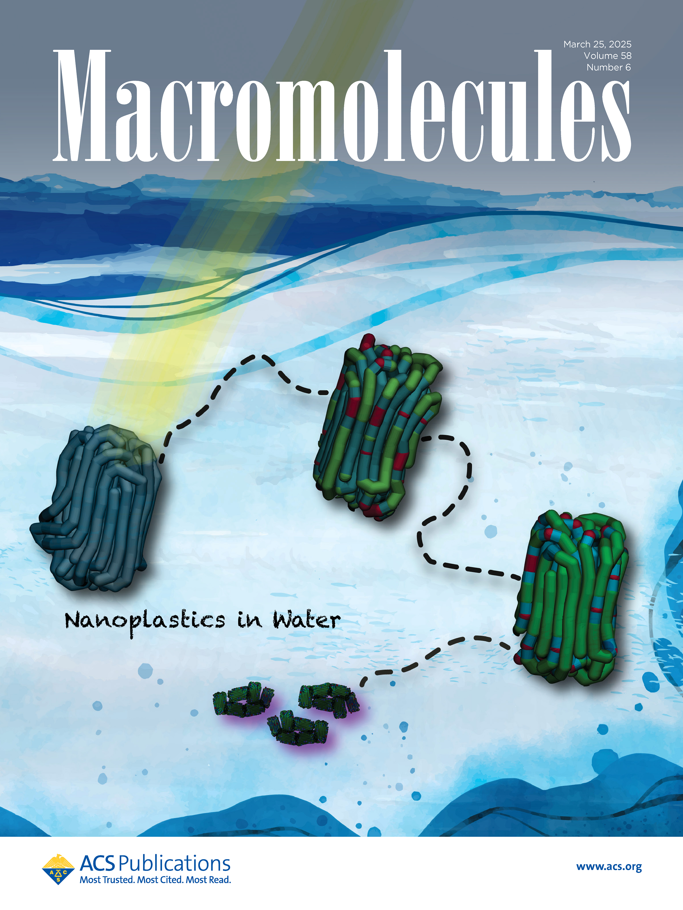
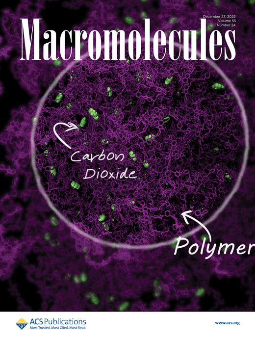
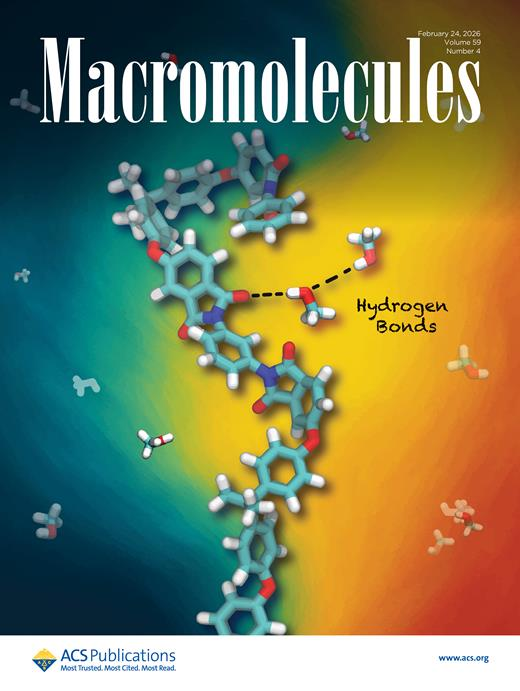

## A selection of methodological papers

The papers below provide a compact entry point into some of the methods I have developed or helped to develop, from systematic coarse-graining and reverse mapping to hybrid particle–field molecular dynamics and its extensions. The broader scientific path connecting these works is described [here](scientific-path.qmd).

## Hybrid particle-field molecular dynamics 

**G. Milano; T. Kawakatsu**, “Hybrid Particle-Field Molecular Dynamics Simulations for Dense Polymer Systems”, *J. Chem. Phys.* **2009**, *130*, 214106. [DOI](https://doi.org/10.1063/1.3142103)

This is where hPF-MD began. Together with Toshihiro Kawakatsu, I developed hybrid particle-field MD a framework that preserves molecular architecture and chemical identity while replacing explicit non-bonded pair interactions with forces calculated by density fields. We subsequently completed its thermodynamic formulation for NPT hybrid simulations by deriving the pressure tensor in **G. Milano; T. Kawakatsu**, “Pressure Calculation in Hybrid Particle-Field Simulations”, *J. Chem. Phys.* **2010**, *133*, 214102. [DOI](https://doi.org/10.1063/1.3506776)

**A. De Nicola; Y. Zhao; T. Kawakatsu; D. Roccatano; G. Milano**, “Hybrid Particle-Field Coarse-Grained Models for Biological Phospholipids”, *J. Chem. Theory Comput.* **2011**, *7*, 2947–2962. [DOI](https://doi.org/10.1021/ct200132n)

This work brought hPF-MD into the world of biological membranes. It showed that field-mediated simulations could retain amphiphilicity, molecular architecture and chemical identity of several biological phospholipids.

**Y.-L. Zhu; Z.-Y. Lu; G. Milano; A.-C. Shi; Z.-Y. Sun**, “Hybrid Particle–Field Molecular Dynamics Simulation for Polyelectrolyte Systems”, *Phys. Chem. Chem. Phys.* **2016**, *18*, 9799–9808. [DOI](https://doi.org/10.1039/C5CP06856H) The next challenge was electrostatics. In this work, we extended hPF-MD to charged systems by letting charged particles interact through electrostatic fields determined self-consistently from the charge-density distribution. The method combined a reciprocal-space treatment of long-range electrostatics with a local field representation of the short-range contribution. 

**A. De Nicola; T. Kawakatsu; G. Milano**, “Generation of Well-Relaxed All-Atom Models of Large Molecular Weight Polymer Melts: A Hybrid Particle–Continuum Approach Based on Particle-Field Molecular Dynamics Simulations”, *J. Chem. Theory Comput.* **2014**, *10*, 5651–5667. [DOI](https://doi.org/10.1021/ct500492h) Here we used particle–field molecular dynamics in a different way: to accelerate the equilibration of fully atomistic polymer melts. The complete all-atom model was retained, while soft field-mediated interactions allowed slow collective relaxation to proceed much more efficiently. The resulting structures could then be returned directly to conventional atomistic simulations, without coarse-graining, parametrization or reverse mapping.

**G. Munaò; A. Pizzirusso; A. Kalogirou; A. De Nicola; T. Kawakatsu; F. Müller-Plathe; G. Milano**, “Molecular Structure and Multi-Body Potential of Mean Force in Silica–Polystyrene Nanocomposites”, *Nanoscale* **2018**, *10*, 21656–21670. [DOI](https://doi.org/10.1039/C8NR05135F) This work introduced two methodological developments in hPF-MD: a field-based representation of the nanoparticle inner core and our first implementation of thermodynamic integration within the particle–field framework. The results showed that effective interactions between mesoscale objects cannot always be reduced to transferable pair potentials: many-body contributions can play a decisive role in nanoparticle organization and help explain experimentally observed morphologies.

These five papers provide a compact view of some early steps in this field, from the original hPF-MD formulation to biological membranes, all-atom polymer relaxation, electrostatics and free-energy calculations. They are not an endpoint: each opened directions that continue to develop in more recent work.

## Coarse-Graining and Backmapping

Selected publications on Iterative Boltzmann Inversion, Gaussian effective potentials, and backmapping.

- **Multicentered Gaussian-Based Potentials for Coarse-Grained Polymer Simulations: Linking Atomistic and Mesoscopic Scales**  
  G. Milano, S. Goudeau, and F. Müller-Plathe  
  *Journal of Polymer Science Part B: Polymer Physics* **43**, 871–885 (2005)  
  `Gaussian potentials`  
  [DOI](https://doi.org/10.1002/polb.20380)

- **Mapping Atomistic Simulations to Mesoscopic Models: A Systematic Coarse-Graining Procedure for Vinyl Polymer Chains**  
  G. Milano and F. Müller-Plathe  
  *The Journal of Physical Chemistry B* **109**, 18609–18619 (2005)  
  `IBI` `Systematic coarse-graining`  
  [DOI](https://doi.org/10.1021/jp0523571)

- **From Mesoscale Back to Atomistic Models: A Fast Reverse-Mapping Procedure for Vinyl Polymer Chains**  
  G. Santangelo, A. Di Matteo, F. Müller-Plathe, and G. Milano  
  *The Journal of Physical Chemistry B* **111**, 2765–2773 (2007)  
  `Backmapping`  
  [DOI](https://doi.org/10.1021/jp066212l)

## Covers 

:::: {.grid}

::: {.g-col-12 .g-col-sm-6 .g-col-lg-4}
{width="100%" fig-alt="Journal cover featuring carbon black simulations"}
:::

::: {.g-col-12 .g-col-sm-6 .g-col-lg-4}
{width="100%" fig-alt="Journal cover featuring nanoplastics"}
:::

::: {.g-col-12 .g-col-sm-6 .g-col-lg-4}
{width="100%" fig-alt="Journal cover featuring molecular simulations"}
:::

::: {.g-col-12 .g-col-sm-6 .g-col-lg-4}
{width="100%" fig-alt="Macromolecules cover featuring a carbon black interface"}
:::

::: {.g-col-12 .g-col-sm-6 .g-col-lg-4}
{width="100%" fig-alt="Journal cover featuring polyethyleneimine and carbon dioxide"}
:::

::: {.g-col-12 .g-col-sm-6 .g-col-lg-4}
{width="100%" fig-alt="Journal cover featuring polyethyleneimine and methanol"}
:::

::: {.g-col-12 .g-col-sm-6 .g-col-lg-4}
{width="100%" fig-alt="Journal cover featuring artificial intelligence and molecular fields"}
:::

::: {.g-col-12 .g-col-sm-6 .g-col-lg-4}
{width="100%" fig-alt="Journal cover featuring molecular simulation research"}
:::

::: {.g-col-12 .g-col-sm-6 .g-col-lg-4}
{width="100%" fig-alt="Journal cover featuring polymer brushes"}
:::

::::

## Complete publication list

A complete and updated publication list is available from ORCID, Google Scholar, Scopus and Web of Science.
