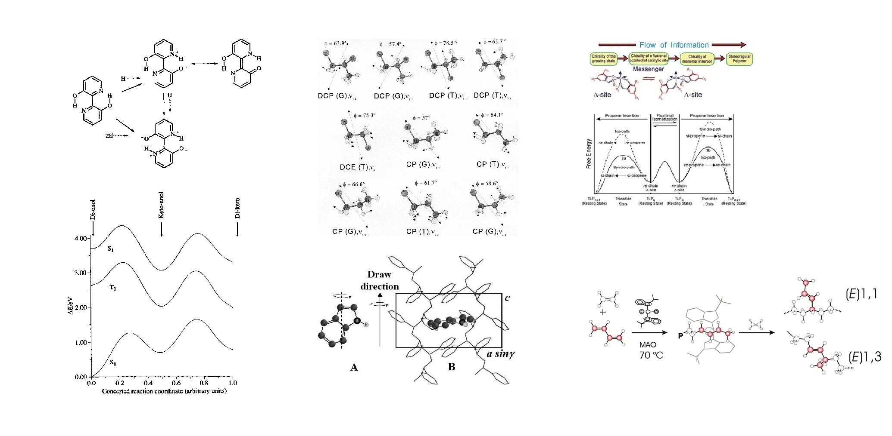
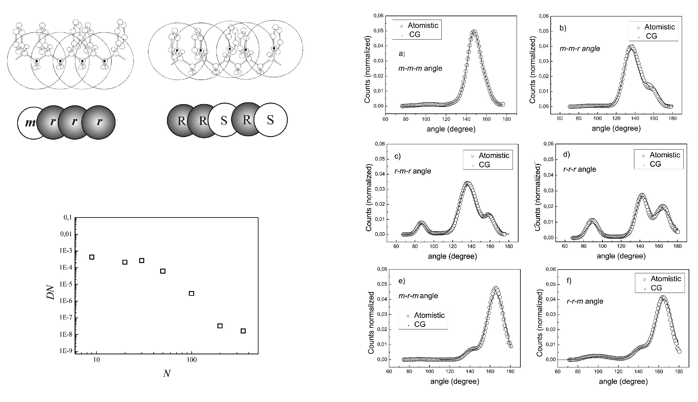
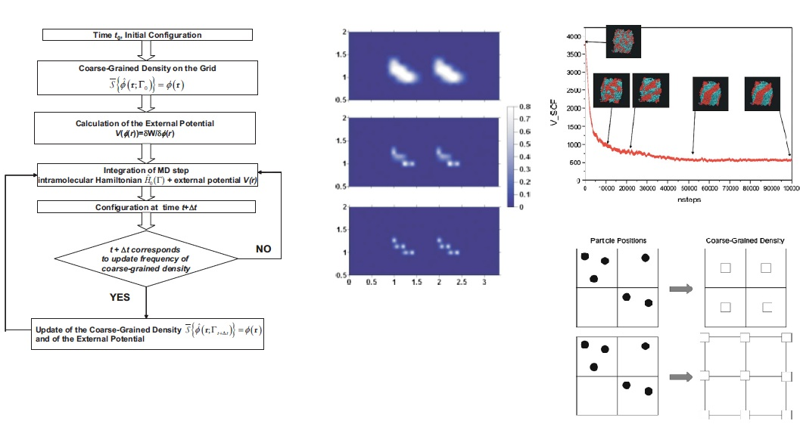
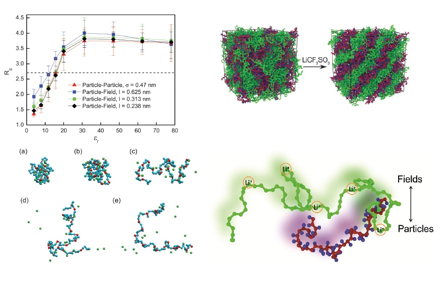

My scientific path began from a fascination with the theoretical foundations of molecular science.

As a student, I was especially attracted by quantum mechanics, statistical mechanics and theoretical spectroscopy. I was interested in how abstract physical descriptions of matter could become computational tools for understanding molecular structure, spectra and reactivity.

The works shown here belong to that early period — almost my scientific childhood. They include studies of proton transfer in excited states, calculations of infrared transition moments, and early applications of QM/MM methods to chemical reactivity.

Although these topics may seem far from my current work on soft matter and particle-field simulations, they shaped an important part of my scientific attitude: the idea that simulation is a bridge between physical theory, numerical methods and chemical interpretation.

[{width="85%" fig-alt="Early works on electronic-structure methods, theoretical spectroscopy and QM/MM reactivity"}](https://doi.org/10.1039/P29950001141){target="_blank"}

*Early works on electronic-structure methods, theoretical spectroscopy and QM/MM reactivity. I was 24 when I started working on the first paper shown here, on proton transfer in excited states.*

## From electronic structure to molecular simulation

I continued to use quantum-mechanical calculations for some time, and I still regard them as essential whenever the problem requires an electronic-level description. However, as my focus moved toward polymeric materials, it became increasingly clear that electronic-structure methods alone could not answer many of the questions I was interested in.

Polymeric materials require a different level of description. Their properties depend not only on local molecular structure or reactivity, but also on conformational organization, intermolecular packing, relaxation, dynamics, collective behaviour and thermodynamic averages.

This is where atomistic molecular simulation became central to my work.

Molecular dynamics offered a natural extension of the statistical-mechanical ideas that had fascinated me as a student. Concepts that first appeared in idealized models of matter became operational tools for studying real molecular systems: ensembles, fluctuations, correlation functions, trajectories and averages.

[{width="85%" fig-alt="Early atomistic molecular dynamics works"}](https://doi.org/10.1021/cm011297i){target="_blank"}

*This MD study grew out of a research period at the Max Planck Institute for Polymer Research in Mainz with Florian Müller-Plathe, an experience that was central in shaping my view of molecular simulation.*

Polymers were a particularly fertile setting for this transition. They have a clear molecular and chemical identity, but their behaviour is governed by long relaxation times, collective organization and mesoscale structure.

That experience also made clear the limitations of fully atomistic simulations for many soft-matter problems. Atomistic models are chemically detailed and physically transparent, but polymeric and soft-matter systems often require access to length and time scales that are difficult to reach at full molecular resolution.

## Coarse-graining without losing chemistry

The limitations of fully atomistic simulations led me toward coarse-grained molecular models.

For me, coarse-graining was never only a way to make simulations faster. It was a way to ask a more subtle question: which molecular information must be preserved when the resolution of a model is reduced?

This became particularly clear in the case of vinyl polymers. These systems are chemically simple in their repeating architecture, but their properties depend strongly on stereochemical sequences along the chain. A chemically meaningful coarse-grained model should therefore retain this information rather than treating the polymer as a generic bead-spring chain.

In this context, I worked on systematic procedures to map atomistic simulations of vinyl polymers into mesoscopic models. The coarse-grained beads were chosen to correspond to stereochemical diads along the polymer chain.

Each bead represented a meso or racemo diad, with the bead type assigned according to the local stereochemical relation between consecutive monomeric units. In this way, the coarse-grained chain was not a generic sequence of identical beads: it retained a chemically meaningful stereochemical code inherited from the atomistic model.

This was important because the stereochemical sequence of vinyl polymers affects chain conformations and material properties. By transferring this information to the coarse-grained representation, the model could remain simpler and faster while still preserving one of the essential chemical features of the original polymer.

[{width="85%" fig-alt="Early coarse-graining works"}](https://doi.org/10.1021/jp0523571){target="_blank"}

*Coarse-graining of vinyl polymer chains: atomistic information is mapped onto mesoscopic beads corresponding to meso and racemo diads, preserving stereochemical sequences.*

One of the tools used in this phase was iterative Boltzmann inversion. The idea is to refine an effective interaction so that the coarse-grained model progressively reproduces a target structural distribution extracted from atomistic simulations:

$$
U_{n+1}(r) =
U_n(r) +
k_\mathrm{B}T
\ln
\frac{g_n(r)}{g_\mathrm{target}(r)} .
$$

Here, \(g_n(r)\) is the distribution generated by the current coarse-grained potential, while \(g_\mathrm{target}(r)\) is the corresponding distribution obtained from the atomistic reference model.

The same philosophy can be applied not only to non-bonded radial distribution functions, but also to the structural distributions that define the molecular architecture of the coarse-grained chain: bond lengths, bond angles and local conformational correlations.

A related development was the introduction of multicentered Gaussian-based potentials for coarse-grained polymer simulations. In realistic polymer models, bond and angle distributions are often not simple single-peaked functions. They may contain several preferred regions, reflecting the underlying atomistic structure. A flexible but still analytical way to represent such distributions is to write them as sums of Gaussian functions:

$$
P(\theta) =
\sum_{i=1}^{n}
\frac{A_i}{w_i\sqrt{\pi/2}}
\exp\left[
-2\frac{(\theta-\theta_{ci})^2}{w_i^2}
\right] .
$$

The corresponding effective potential can then be obtained by Boltzmann inversion:

$$
U(\theta) =
- k_\mathrm{B}T
\ln P(\theta)
+ C .
$$

This provided an analytical and interpretable alternative to fully tabulated bonded potentials, while retaining the flexibility needed to reproduce complex atomistic target distributions.

At the same time, I became interested in the inverse problem: how to reconstruct chemically realistic atomistic structures from coarse-grained configurations. Reverse mapping was not only a technical step. It was a way to keep simplified models connected to molecular chemistry.

For vinyl polymers, this problem is particularly delicate because the reconstruction must preserve local stereochemistry. The atomistic fragments must therefore be placed onto the coarse-grained geometry by proper rotations, avoiding reflections that would invert chirality.

In the reverse-mapping procedure, atomistic diads were selected from a library of conformations compatible with the local stereochemical sequence and with the coarse-grained geometry. The problem then became one of optimal superposition: how to rotate and translate each atomistic fragment so that it matched the corresponding coarse-grained sites and the previously inserted part of the chain.

Quaternions offered a compact and robust way to solve this problem. They are elegant mathematical objects for describing rotations in three-dimensional space. In this context, quaternion-based maximization of the structural overlap provided the optimal rotation matrices in real space.

These rotation matrices were then used to place the selected atomistic fragments onto the coarse-grained chain, allowing the reconstruction to proceed analytically, fragment by fragment, while preserving stereochemistry. Because the procedure is geometrical and analytical, it avoids expensive potential-energy and force evaluations and makes the reconstruction of atomistic detail very fast.

A unit quaternion,

$$
\mathbf q =
(q_0,q_1,q_2,q_3),
\qquad
\|\mathbf q\|=1 ,
$$

The optimal quaternion is obtained from the symmetric eigenvalue problem

$$
\mathbf K \mathbf q = \lambda \mathbf q ,
$$

where the matrix \(\mathbf K\) is built from the coordinate sums of the two structures to be superimposed. The eigenvector associated with the smallest eigenvalue gives the unit quaternion corresponding to the optimal rotation.

defines a rotation matrix \(\mathbf R(\mathbf q)\) that can be used to place an atomistic fragment onto the corresponding coarse-grained geometry.
The quaternion corresponding to the optimal rigid rotation can be obtained by solving the eigenvalue problem

[{width="85%" fig-alt="Early reverse-mapping works"}](https://doi.org/10.1021/jp066212l){target="_blank"}

*Reverse mapping: equilibrated coarse-grained configurations can be transformed back into chemically detailed atomistic structures by selecting compatible atomistic fragments and placing them through optimal real-space rotations.*

A later step showed the full potential of this approach. The diad-based coarse-grained model was combined with connectivity-altering Monte Carlo algorithms, allowing the equilibration of atactic polystyrene melts with molecular weights that would be extremely difficult to access directly at atomistic resolution.

This was a key multiscale result: stereochemical information was preserved at the coarse-grained level, long-chain conformations and entanglements could be equilibrated efficiently, and the resulting configurations could be reverse-mapped into detailed united-atom structures for comparison with atomistic and experimental observables.

[{width="85%" fig-alt="Early reverse-mapping works"}](https://doi.org/10.1021/ma0700983){target="_blank"}

Beyond the specific techniques, algorithms and mathematical tools, this phase expressed a broader scientific attitude: molecular models can move forward and backward across resolutions. Atomistic chemistry can be mapped into simpler descriptions, larger scales can be reached, and atomistic detail can be recovered when needed.

For me, the central point was not only acceleration, but continuity: extending the scale of molecular simulation without giving up a chemically meaningful description of matter.

This attitude naturally prepared the next step in my work: the encounter with field-based descriptions of soft matter.

## Particles and fields

The question then became: can field-based descriptions be incorporated into molecular dynamics without abandoning particles altogether?

The idea of combining particles and fields has an important background in computational polymer physics. In particular, the single-chain-in-mean-field (SCMF) Monte Carlo approach developed by Marcus Müller and co-workers showed how coarse-grained polymer models could be represented through beads interacting with density fields.

My own contribution entered this landscape from a molecular-simulation and molecular dynamics perspective. Together with Toshihiro Kawakatsu, I developed the hybrid particle-field molecular dynamics approach, where chemically specific molecular models are propagated by molecular dynamics while their collective non-bonded interactions are described through self-consistent fields.

This distinction was important for me. The field representation provided the collective soft-matter description, while molecular dynamics preserved trajectories, molecular architecture, bonded interactions and chemical specificity.

In hPF-MD, molecular particles retain architecture, connectivity and chemical identity, while collective non-bonded interactions are described through density fields. This was the conceptual bridge I was looking for: particles carry molecular structure; fields describe mesoscale organization.

A generic density field associated with a molecular species or bead type can be written as

$$
\rho_\alpha(\mathbf r) =
\sum_{i \in \alpha}
w_i \,
g(\mathbf r-\mathbf r_i) ,
$$

where $g(\mathbf r-\mathbf r_i)$ is a smoothing or assignment function centred on particle $i$, and $w_i$ is a weight associated with that particle.

The non-bonded part of the model can then be expressed as a functional of the density fields,

$$
U_\mathrm{field}
=
\int d\mathbf r \,
f\left(\rho_1(\mathbf r),\rho_2(\mathbf r),\ldots\right) .
$$

From a statistical-mechanical point of view, this idea is related to field-theoretical transformations such as the Hubbard--Stratonovich transformation. These transformations make it possible to rewrite density--density interactions in terms of auxiliary fields coupled to molecular densities.

In the saddle-point approximation, the auxiliary field becomes a self-consistent external potential acting on the molecular particles. In the hybrid particle--field formulation, this operational idea is expressed by obtaining the external potential from the functional derivative of the non-bonded density functional:

$$
V_\alpha(\mathbf r)
=
\frac{\delta U_\mathrm{field}}
{\delta \rho_\alpha(\mathbf r)} .
$$

The force on a particle of type \(\alpha\) then follows from the spatial variation of this potential:

$$
\mathbf F_i
\simeq
- w_i
\nabla V_\alpha(\mathbf r)
\bigg|_{\mathbf r=\mathbf r_i}.
$$

[{width="85%" fig-alt="Early hPF-MD works"}](https://doi.org/10.1021/jp066212l){target="_blank"}

In particle--field molecular dynamics, this field-based view becomes an operational simulation strategy: molecular particles evolve under fields generated by molecular densities.

### Extending particle--field simulations to charged systems

A further important step was the extension of the hybrid particle--field framework to charged molecular systems.

[{width="85%" fig-alt="Early hPF-MD works"}](https://doi.org/10.1039/c5cp06856h){target="_blank"}

In the original particle--field formulation, non-bonded interactions were described through density fields associated with molecular components. This was highly effective for soft-matter systems dominated by short-range collective interactions, but charged macromolecules and polyelectrolytes required an explicit treatment of electrostatics within the same field-based philosophy.

The key idea was to describe electrostatic interactions not through direct pairwise Coulomb forces between all charged particles, but through electrostatic fields self-consistently determined by the charge density distribution.

In this formulation, the electrostatic potential is split into short- and long-range contributions,

$$
\psi(\mathbf r)
=
\psi^{S}(\mathbf r)
+
\psi^{L}(\mathbf r).
$$

The long-range contribution follows the spirit of Ewald-type treatments. After assigning charge densities to a lattice, the long-range electrostatic potential can be obtained in reciprocal space from the Fourier transform of the charge distribution:

$$
\widehat{\psi}^{L}(\mathbf m)
=
C(\mathbf m)
\sum_{j=1}^{N}
q_j
\exp\left(
i\mathbf m \cdot \mathbf r_j
\right),
$$

with

$$
C(\mathbf m)
=
\frac{
4\pi k_\mathrm{B}T l_\mathrm{B}
\exp\left(-m^2/4\alpha^2\right)
}{
V m^2
}.
$$

Here, $q_j$ is the charge of particle $j$, $l_\mathrm{B}$ is the Bjerrum length, $V$ is the simulation box volume, and $\alpha$ controls the Ewald splitting.

The most original part of the construction concerns the short-range electrostatic contribution. In conventional molecular dynamics, this part would normally be treated as a pairwise interaction. In the particle--field framework, however, the interaction must be expressed in terms of fields. This was achieved by mapping the short-range electrostatic energy onto a Flory--Huggins-like mean-field parameter:

$$
w_e
=
z_\mathrm{CN}
l_\mathrm{B}
\frac{\mathrm{erfc}(\alpha\sigma)}{\sigma}.
$$

Here, $z_\mathrm{CN}$ is a coordination number, $\sigma$ is the coarse-grained particle diameter, and $\mathrm{erfc}(\alpha\sigma)/\sigma$ represents the short-range Ewald contribution at the coarse-grained contact distance.

The corresponding short-range electrostatic potential at a lattice point can then be written in density-field form as

$$
\psi^{S}(\mathbf l)
=
k_\mathrm{B}T \,
w_e \,
Q(\mathbf l),
$$

where $Q(\mathbf l)$ is the charge density assigned to the lattice point $\mathbf l$.

This step is conceptually important. It translates the short-range part of electrostatics into the same language used for composition fields in hybrid particle--field simulations: a local field proportional to a density. The long-range electrostatic contribution is handled through Fourier-space solution of the field, while the short-range contribution is absorbed into a local mean-field parameter.

The resulting electrostatic field acts back on the charged particles, allowing energies and forces to be obtained by interpolation from the lattice fields. In this way, charged particles retain their molecular identity and charge, while electrostatic organization is described through self-consistent fields.

This extension opened the possibility of applying hybrid particle--field molecular dynamics to polyelectrolytes, charged block copolymers, ionic systems and, more generally, soft-matter systems where electrostatics and mesoscale organization are coupled.

## Biological and soft-matter complexity

An important part of this trajectory has been the application of coarse-grained and hybrid particle--field models to biological and bio-inspired soft matter.

Membranes are a particularly demanding test for molecular simulation. They are organized, heterogeneous and dynamic; at the same time, their behaviour depends on molecular architecture, lipid composition, headgroup chemistry, tail structure, electrostatics, hydration and interactions with surrounding molecules or particles.

[{width="85%" fig-alt="Early hPF-MD works"}](https://doi.org/10.1021/ct200132n){target="_blank"}

This is especially true for bacterial membrane models and lipid systems inspired by the outer membrane of Gram-negative bacteria, where chemical specificity and collective organization are tightly coupled. These systems helped me to test how far coarse-grained and particle--field approaches could be pushed while retaining a meaningful connection to molecular detail.

[{width="85%" fig-alt="Early hPF-MD works"}](https://doi.org/10.1039/d3nr00559c){target="_blank"}

For me, such applications were not a departure from the methodological path. They were a way to test it in systems where complexity is not only large-scale, but also chemical and biological.

## OCCAM

The development of OCCAM is part of the same path.

OCCAM was not born only as an implementation of hybrid particle--field molecular dynamics. In its earliest form, before 2007, it was already a molecular dynamics code for chemically specific coarse-grained models, including models based on iterative Boltzmann inversion and analytical effective potentials.

This origin is important for understanding its later role. OCCAM provided a working environment in which molecular models, effective potentials, algorithms and physical ideas could be modified directly. Having an independent code lowered the barrier to methodological innovation: new ideas could be implemented, tested and connected to applications without waiting for them to fit into an existing software architecture.

The development of hybrid particle-field molecular dynamics followed precisely this route. The study of field-based statistical mechanics and self-consistent field ideas did not remain only a theoretical influence. Through OCCAM, these ideas became an operational molecular simulation method, in which particles retain molecular architecture while non-bonded interactions are described through density fields.

In this sense, OCCAM was not simply the software that later hosted hPF-MD. It was one of the enabling conditions for its development. It provided the technical and conceptual continuity between coarse-grained molecular dynamics, field-theoretical ideas and chemically specific soft-matter applications.

For me, software is not separate from scientific vision. It is the place where theoretical ideas become operational, where algorithms reveal their strengths and limitations, and where applications show what a method can and cannot do.

This experience also shapes the way I think about training young researchers.

## The craft of simulation code

However, those who want to develop new simulation methods should, sooner or later, experience the discipline of writing simulation code closer to the hardware and to the numerical structure of the algorithm, in languages such as Fortran, C or C++.

Implementing a method forces one to understand it at a deeper level. It makes approximations explicit, exposes numerical assumptions, and shows where an elegant theoretical idea becomes fragile, robust or useful.

For this reason, I see simulation code as part of scientific formation. It is not only an instrument for producing results, but a place where physical intuition, mathematical formulation, algorithmic thinking and chemical interpretation come together.

OCCAM also reflects a broader view of scientific training.

There is a craft dimension in this process. Perhaps one could say, with a smile, that writing a simulation code is closer to learning the way of the sword than to simply using a more powerful weapon. It is not about nostalgia for older tools, and certainly not about rejecting modern software. It is about discipline, control, attention to detail, and understanding the instrument through practice.

[{width="85%" fig-alt="Early atomistic molecular dynamics works"}](https://en.wikipedia.org/wiki/The_Book_of_Five_Rings){target="_blank"}

Implementing a method forces one to understand it at a deeper level. It makes approximations explicit, exposes numerical assumptions, and shows where an elegant theoretical idea becomes fragile, robust or useful.

For this reason, I see simulation code as part of scientific formation. It is not only an instrument for producing results, but a training ground where physical intuition, mathematical formulation, algorithmic thinking and chemical interpretation come together.

In this sense, OCCAM is also a training environment: a place where young researchers can learn how molecular models, algorithms and scientific questions are connected.

## A continuing direction

Looking back, the systems and methods have changed, but the underlying question has remained remarkably stable.

How can molecular simulation describe complex systems across scales while preserving the chemical identity of matter?

My path toward larger scales and more efficient methods has never been a path of replacement. I have not seen coarse-graining, field-based descriptions or hybrid particle-field molecular dynamics as ways to leave atomistic modelling behind, but as ways to carry forward what atomistic modelling teaches: molecular architecture, chemical specificity, physically grounded interactions and a disciplined connection between models and interpretation.

In this sense, moving across scales does not mean abandoning the previous level of description. It means preserving what is essential from it, translating it when needed, and building methods that remain connected to molecular chemistry even when they operate at larger length and time scales.

This attitude continues to guide my current work on coarse-grained and hybrid particle-field approaches, density-based descriptions, scalable simulation methods and applications to complex soft matter, materials and biological interfaces.